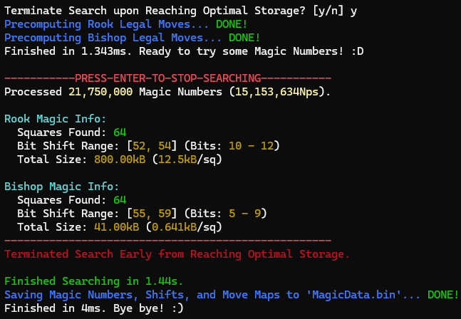

# Chess 'Fancy Magic' Number & Bitboard Generator


---

A lightweight tool built to brute-force search and pre-compute the **magic numbers** used for a chess computer's 'fancy magic' bitboard move generation (specifically, sliding pieces such as rooks, bishops, and queens). Heavily optimised with multithreading, generational and perfect collision resolution, and a hand-written RNG, allowing the program to find the known 'fancy magic' **theoretical optimal** size in **under 1.5s**.  
Rather than traditional ray-casting methods, where a sliding piece's legal moves are generated via 4 for-loops in each direction (stopping once we reach a piece, or the edge of the board), 'magic' move generation **pre-computes** a massive **hashed lookup table** of all the pseudo-legal moves each of the sliding pieces can make (given a key, that being the bitmap of other pieces that lie in the sliding piece's rays), that can be retrieved in O(1). This program performs its own multithreaded search **from scratch**, continuously hunting for smaller and smaller perfect-hashing tables via a live, colour-coded terminal dashboard, before exporting the final results as a compact binary file.

The program outputs a serialised binary file (at the executable path) containing two arrays of 'MagicInfo' structures (see source code for more details), the first for rooks and the second for bishops. This structure is in the following format:
```vb
Public Structure MagicInfo
    Public Magic As UInt64     '64-bit unsigned magic number, with 87.5% set sparsity and always containing at least 6 set bits.
    Public Shift As Integer    'Number of places to shift the "Magic * Blocker Mask" key, to produce an entry in the array of legal moves.
    Public MoveMap() As UInt64 'Hashed array of legal moves, containing the movement map for a rook at each location with specific blocker patterns.
End Structure
```

This work is self-motivated and self-funded, and forms a small part of my 'commercial grade' [**Chess Game & Artificial Intelligence**](https://github.com/AlfieKunz/Chess-Game-AI): magic numbers found by this tool (along with the pre-computed hash table of sliding piece pseudo-legal moves) are fed directly into the main engine, producing blazing-fast move generation of sliding pieces.

This project is written primarily in VB.NET as a Visual Studio console application.

<p align="center">
  
</p>

---

## Features and Highlights

✅ Full ray-casting pre-computed move generation for both rooks and bishops (for efficient lookups during magic number generation).  
✅ From-scratch derivation of each square's "relevant occupancy" mask (the 'key' as mentioned earlier, containing possible blocking piece locations), taking care to exclude edge squares and pairing of all 2^n subsets with their resulting legal-move bitboard.  
✅ Hand-written 'Xoshiro256' PRNG (SplitMix64-seeded for a well-distributed initial state) for each thread to avoid correlation.  
✅ Ultra-fast generation and processing (~18M per second) of magic numbers, finding the fancy optimal storage solution in under 1.5s (800kB of storage for rook moves, 41kB for bishop moves).  
✅ Parsing of ill-fit magic number candidates immediately upon generation (producing sparse numbers whilst rejecting whose with few set bits).  
✅ 'Greedy shrink' searching strategy, tightening the shift value by 1 bit immediately upon spotting a collision-free magic/shift pairing for some square.  
✅ 'Generation-stamped' collision resolutions: stores a time-stamp for each hashed value, allowing stale entries to be safely overwritten instead of restarting the search.  
✅ 'Perfect' collision resolutions: ignores collisions that occur when two blocker keys which (by one blocking piece hiding behind another) generate the same pseudo-legal moves, access the same array index.  
✅ Fully parallelised, automatically scaling and delegating batches of squares to variable worker threads and the UI.  
✅ Real-time console outputs (self-refreshing) displaying search diagnostics, per-piece breakdown of squares solved (and their sizes), and colour-coded throughout to illustrate when we have found any solution to the search, and the optimal solution.  
✅ Optional auto-termination once both rook and bishop tables simultaneously reach their theoretical-optimal size (along with manual termination).  
✅ Binary serialisation of the final data, ready to be dropped directly into any chess engine!  

---

## Project Showcase

> **Project Demo:** You can see this project live directly through the [**project build**](https://drive.google.com/open?id=1XNjrBzgGa3Rgt-1cntzvTwKjdx_Q30mW&u) (Intel 32/64-bit). Simply click the 'Download All' button in the link attached, unzip and run the "Magic-Generator.exe" application.

> **Program Controls:**
>1) Immediately on launch, choose whether to automatically stop searching once both the rook and bishop tables reach their known theoretical-optimal size (`Y`), or keep searching indefinitely for further improvements (until manually stopped) (`N`). The program will then instantly pre-compute all rook & bishop move and blocker masks for all 64 squares.
>2) Hit ENTER to begin the magic number search. The console will update with search diagnostics, along with the best magic numbers found so far. Hit ENTER again to stop at any time.
>3) Once the search stops, the final magic numbers, shifts, and move-map hash arrays for all 64 rook and bishop squares are serialised to a binary output file, ready for immediate loading by a chess engine.

---

## Technical Details

Unlike other pieces, the legal moves of sliding chess pieces (rooks, bishops, and queens) depend entirely on which squares are occupied along their rays, since a ray stops dead the moment it meets a blocking piece. Computing these rays for each square, for every rook and bishop, for every move, for every chess node in the search tree, is by far the most expensive part of a naive move generator. The modern solution is to simply compute all this data beforehand (every sliding piece placement, for every possible blocker configuration), then look up the moves in a precomputed table when needed. However, the bitmaps of blocking pieces produce huge denary values, making traditional dictionary lookup approaches cause more harm than good.

For each square, we construct a bitboard called the relevant occupancy mask, which contains all possible configurations for blocker pieces (which lie in the sliding piece's rays). <a href="https://www.youtube.com/watch?v=_vqlIPDR2TU&t=30m08s" target="_blank" rel="noopener noreferrer">Sebastian Lague</a> has a great video on how to construct these masks (note that my program uses an inverted mask system, where a8 is 1UL rather than Sebastian's version of a1 being 1UL). We can immediately cut the table by a factor of up to 32x by realising that the square in a sliding piece's ray that finishes at the board edge does not care whether there is an enemy piece on it - the sliding piece can always move to that square (either by a regular move, or by capturing the blocking piece) - we thus exclude the board edges from the search. From this mask, we can multiply by that square's carefully chosen 64-bit constant (the *magic* number), then bitwise right-shift the result down to a small number (memory-conscious), which forms the index into an array which stores the pseudo-legal moves for that configuration! Assuming our magic numbers and shift values are chosen well, this behaves as a perfect hash.

This forms the algorithm to efficiently store all legal moves: for each square, we start with a massive array and test thousands of randomly-generated magic numbers such that every occupancy mask for that cell has a unique entry. Once we have an injective map, we shrink the array by a factor of two (or rather, incrementing the number we right-shift by) and keep searching for magic numbers, until we hit a dead end. 'Fancy' magic bitboards improve on this concept by allocating a shift value for each square (rather than a global value): this allows for pieces which have few legal moves (eg: a bishop trapped on a1, vs a rook on e5) to have their moves much more efficiently stored, meaning our pre-computed tables fit effortlessly into L2 CPU cache.

The known theoretical limit for how tightly we can pack our array is by using a 2^12 array for the rook, and a 2^9 array for the bishop (giving table sizes of 800kB and 41kB respectively). My program is able to find this optimal solution in under **1.5s** of searching.

---

## Installation and Folder Structure

### Required Software: Visual Studio (.NET 8.0).

To install, simply clone this repository using the following terminal prompts.
```bash
git clone https://github.com/AlfieKunz/Chess-Magic
cd Chess-Magic
```
Then, simply open the "Magic-Generator.sln" file in Visual Studio.

Feel free to also fork this repository, open an issue, or submit pull requests. All contributions welcome! :)  
To better navigate this project, please see below for the related folder structure.

```
Magic-Generator
├─ Magic-Generator
│  └─ Program.vb       // Main program code: RNG, computation of move masks, magic number searching, serialisation, UI and thread handling
└─ Magic-Generator.sln // Main VS code solution
```

---

## References & Inspiration

This work is self-motivated and self-funded. If you use this code or data in your work, please cite the associated preprint:

**Text Citation:**
> Kunz, A. (2026). *Chess 'Fancy Magic' Number & Bitboard Generator*. Available at https://github.com/AlfieKunz/Chess-Magic.

**BibTeX:**
```bibtex
@software{Kunz2026ChessMagic,
  title = {Chess 'Fancy Magic' Number & Bitboard Generator},
  author = {Kunz, Alfie},
  year = {2026},
  url = {https://github.com/AlfieKunz/Chess-Magic}
}
```

Project inspired from work by <a href="https://www.youtube.com/watch?v=_vqlIPDR2TU" target="_blank" rel="noopener noreferrer">Sebastian Lague</a>, and the <a href="https://www.chessprogramming.org/Magic_Bitboards" target="_blank" rel="noopener noreferrer">Chess Programming Wiki</a>.